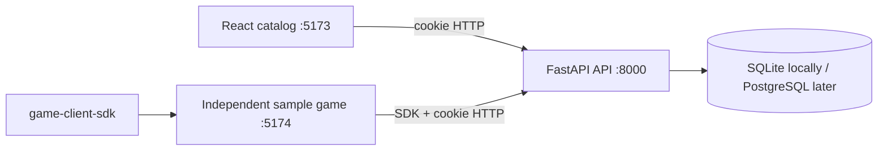

# Architecture

The platform is a modular monolith sized for roughly ten concurrent users. The catalog browser app and each game are separately built browser applications. They communicate with one FastAPI API through explicit HTTP contracts; games use the framework-independent client SDK rather than importing catalog code.

## Components and flow

The catalog uses React Router and TanStack Query. It fetches `/auth/me`; an unauthenticated visitor is redirected to the development login page. Development login selects a seeded identity, receives an HTTP-only signed session cookie, and then returns to the requested route. The catalog calls authenticated `/games` and `/games/{slug}` APIs. The sample game independently asks the SDK for `/auth/me` and its own game metadata.

FastAPI routes are thin. Pydantic schemas validate and serialize boundaries, services carry small business operations, repositories isolate queries, and normal database-backed handlers use ordinary synchronous functions plus synchronous SQLAlchemy sessions. SQLite foreign keys are enabled for each connection. UUIDs are generated in application code and generic SQLAlchemy `Uuid`/standard types preserve PostgreSQL compatibility.

`ExternalIdentity(issuer, subject)` is the durable identity link. The development provider is a narrow implementation of the future auth-provider boundary. The API intentionally does not expose auth tokens to browser JavaScript.

The modular monolith keeps a single deployable, a single database, and clear feature folders (`auth`, `models`, `repositories`, `services`, `api`) without speculative microservice boundaries. More detail and future contracts are in `docs/future`.
