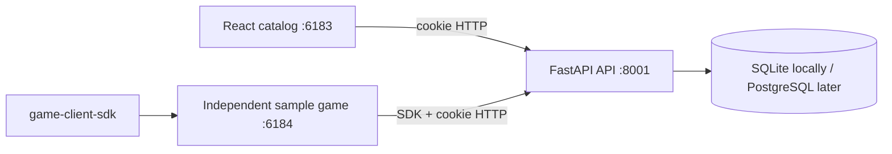

# Architecture

The platform is a modular monolith sized for roughly ten concurrent users. The catalog browser app and each game are separately built browser applications. They communicate with one FastAPI API through explicit HTTP contracts; games use the framework-independent client SDK rather than importing catalog code.

## Components and flow

The catalog uses React Router and TanStack Query. It fetches `/auth/me`; an unauthenticated visitor is redirected to the development login page. Development login selects a seeded identity, receives an HTTP-only signed session cookie, and then returns to the requested route. The authenticated UI calls player, clan, presence, game-session, and leaderboard APIs alongside `/games` and `/games/{slug}`. A small presence effect posts `/presence/heartbeat` immediately and every 60 seconds while the catalog is open.

`PlayerProfile` is a platform-level appearance record, separate from `User`, `Game`, and future per-game save data. It stores a bounded nickname, stable haircut key, and values from server-validated palettes. The same fields drive the catalog avatar renderer and the SDK’s `PlatformPlayer` result.

`GameSession` records a user/game start, last heartbeat, end, and credited seconds. The server credits only the elapsed time since the last heartbeat, capped by `GAME_SESSION_MAX_GAP_SECONDS` (120 seconds by default). A stale session is finalized at that cap when it is encountered later, so an abandoned tab cannot accrue unlimited time.

`LeaderboardDefinition` belongs to one game and is unique by `(game_id, key)`. `LeaderboardEntry` is unique by `(leaderboard_id, user_id)` and is updated by the definition’s server-owned `max`, `min`, `latest`, or `sum` aggregation. Ranking applies the configured direction and stable display-name/UUID tie-breakers. The authenticated user’s row and rank are returned even when it falls outside the requested top limit.

FastAPI routes are thin. Pydantic schemas validate and serialize boundaries, services carry small business operations, repositories isolate queries, and normal database-backed handlers use ordinary synchronous functions plus synchronous SQLAlchemy sessions. SQLite foreign keys are enabled for each connection. UUIDs are generated in application code and generic SQLAlchemy `Uuid`/standard types preserve PostgreSQL compatibility.

`ExternalIdentity(issuer, subject)` is the durable identity link. The development provider is a narrow implementation of the future auth-provider boundary. The API intentionally does not expose auth tokens to browser JavaScript.

The modular monolith keeps a single deployable, a single database, and clear feature folders (`auth`, `models`, `repositories`, `services`, `api`) without speculative microservice boundaries. Presence and game sessions intentionally use ordinary HTTP polling/heartbeats; the rationale is recorded in [`decisions/007-heartbeats-over-realtime.md`](decisions/007-heartbeats-over-realtime.md). More detail and future contracts are in `docs/future`.
